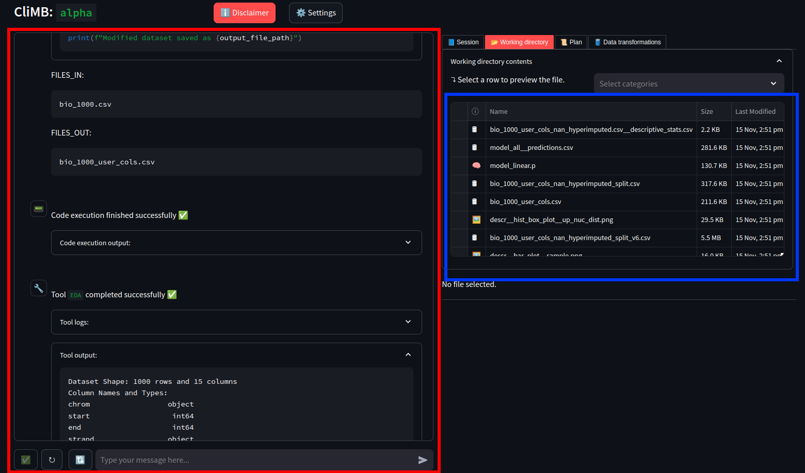

# 🔏 Data Privacy

```{admonition} Warning
:class: attention

It is crucial to understand the data privacy and confidentiality implications of using CliMB. Please ensure to read this section prior to using the system.
```

```{admonition} Important
:class: important

Following this guide does not guarantee compliance with all the relevant laws and regulations, and should not be considered as legal advice. **It is strongly recommended to consult with your organization's legal and compliance teams to ensure that the use of CliMB is acceptable in your specific context.**
```

When using CliMB with real-world clinical data, you as the clinician scientist act as the data steward, and are responsible for ensuring that the use of the data complies with all the relevant laws and regulations, as well as ethical considerations. CliMB aims to provide a secure and privacy-preserving environment for data exploration and model building, while balancing this with leveraging the capabilities of the most advanced large language models (LLMs). This section summarizes the data privacy fundamentals of CliMB and should allow you to make an informed decision about using the system with your data.


## Data privacy related laws and regulations
You should be aware of the data privacy laws and regulations that apply to your data. This may depend on your geographical location, the location of the data, and the nature of the data. Some of the most common data privacy laws and regulations include:
* **General Data Protection Regulation (GDPR)**: The GDPR is a regulation in EU law on data protection and privacy in the European Union and the European Economic Area. It also addresses the transfer of personal data outside the EU and EEA areas. You can find more information about GDPR [here](https://gdpr.eu/what-is-gdpr/).
* **The Data Protection Act 2018 (DPA)**: The DPA is the UK's implementation of the General Data Protection Regulation (GDPR). You can find more information about DPA [here](https://www.gov.uk/data-protection).
* **Health Insurance Portability and Accountability Act (HIPAA)**: HIPAA is a United States legislation that provides data privacy and security provisions for safeguarding medical information. You can find more information about HIPAA [here](https://www.hhs.gov/hipaa/index.html).

For other geographies, other data privacy laws and regulations may apply. Please research and understand the applicable laws and regulations in your context. We strongly recommend that you consult with your organization's legal and compliance personnel to ensure that the use of CliMB is acceptable for your data.


## CliMB's privacy-preserving features
1. **Local storage of data.** All dataset files (original or modified in any way by CliMB) are
stored locally on your machine. Hence, the data files are never uploaded to any third-party servers.
2. **Local code execution.** All code execution performed by CliMB, either through code generation or predefined tool invocation occurs locally on the your machine. Hence, no working directory files of any kind (including saved predictive models, image files, tool output artifacts
etc.) leave the machine that you are using CliMB on.

## Privacy implications of using third-party LLMs
CliMB currently supports the following third-party LLMs providers:
* [OpenAI](https://platform.openai.com/),
* [Azure OpenAI Service](https://learn.microsoft.com/en-us/azure/ai-services/openai/overview).

This allows for making use of more powerful LLMs (GPT-4 and beyond). Integration with locally-deployable LLMs (e.g., the [Hugging Face](https://huggingface.co/) ecosystem) is under development, but not yet available.

In order to use third-party, proprietary LLMs, CliMB uses their API ([What's an API?](https://www.contentful.com/api/)). This means that:
* ⚠️ The **message data** is transferred, encrypted, via the internet to the LLM provider's (cloud) servers, which then generate a response message.
* ⚠️ The **message data** may be stored by the LLM provider for some limited time (e.g., often 30 days) in order to detect and prevent abuse of the API.

```{admonition} Note
:class: note

**Message data** in CliMB is all the content you see in the chat interface, including the text you type, the text the system generates, and the output of code execution and tool invocations. This is also know as "prompts" and "completions", or the "context". This data *may* contain sensitive information, such as variable names, categorical values, and other data that you are working with in your predictive modeling project. It is unlikely to contain any patient records in full, as this is not required in the CliMB workflow, however this is **not guaranteed**.

To simplify for the purposes of an illustration, the message data is everything (the entire history) found in the chat interface (left side, red box) in the image below. These data *do* get sent to the LLM provider's servers. The files in the working directory (right side, blue box) do *not* get sent to the LLM provider's servers. These stay on your machine throughout the session.


```


## Data privacy policies and terms of proprietary LLM providers

It is critical that you understand the terms of service of the LLM provider you choose to use with CliMB. Below are links to the overviews of how each provider uses your data (but a detailed review of the terms of service is highly recommended).

```{admonition} Tip
:class: tip

Please select between the tabs ("OpenAI", "Azure OpenAI Service" etc.) below to see the content for the LLM provider you have chosen.
```

```{tab} OpenAI
Good starting point for understanding the data privacy policies and terms of OpenAI, but this is not meant to be exhaustive:
* [OpenAI Platform - How we use your data](https://platform.openai.com/docs/models/how-we-use-your-data#how-we-use-your-data)
* [Data processing addendum](https://openai.com/policies/data-processing-addendum/)
* [Enterprise Privacy](https://openai.com/enterprise-privacy/)
    * Note that some information provided is **only** relevant to enterprise customers. Most "regular" users will not have access to the same level of privacy controls. The only relevant part for most users is the "API Platform FAQ" subsection.
* [Privacy Policy](https://openai.com/policies/row-privacy-policy/)
* [Terms of use](https://openai.com/policies/row-terms-of-use/)
```
```{tab} Azure OpenAI Service
Good starting point for understanding the data privacy policies and terms of Azure OpenAI Service, but this is not meant to be exhaustive:
* [Data, privacy, and security for Azure OpenAI Service](https://learn.microsoft.com/en-us/legal/cognitive-services/openai/data-privacy?tabs=azure-portal)
* [Privacy in Azure](https://azure.microsoft.com/en-gb/explore/trusted-cloud/privacy)
* [Full Product Terms](https://www.microsoft.com/licensing/terms/search?term=OpenAI)
```

The rest of this section provides high level summaries/illustrations of the data privacy policies and terms of the proprietary LLM providers supported by CliMB. It does not replace the need to read and understand the full terms and their implications.

:::{tab} OpenAI

In case of **OpenAI**, the below applies.

```{admonition} Warning
:class: attention

Any specific information quoted in this section was accurate as of `November 2024`, but this is not static and is likely to change. For up-to-date details, you **must** refer to the live terms and policies online. The *links provided in the previous subsection* are a good starting point.
```

From [OpenAI Platform - How we use your data](https://platform.openai.com/docs/models/how-we-use-your-data#how-we-use-your-data):

> As of March 1, 2023, data sent to the OpenAI API will not be used to train or improve OpenAI models (unless you explicitly opt-in to share data with us, such as by providing feedback in the Playground). One advantage to opting in is that the models may get better at your use case over time.
>
>To help identify abuse, **API data may be retained for up to 30 days**, after which it will be deleted (unless otherwise required by law). For trusted customers with sensitive applications, **zero data retention** may be available. With zero data retention, request and response bodies are not persisted to any logging mechanism and exist only in memory in order to serve the request.

The process for obtaining **zero data retention** is stated as:
> To learn more about zero retention, get in touch with our `sales team`.

For the link, refer to the [original page](https://platform.openai.com/docs/models/how-we-use-your-data#how-we-use-your-data).

You should review the set of links provided above for a better understanding of the data privacy policies and terms of OpenAI.

:::

:::{tab} Azure OpenAI Service

In case of **Azure OpenAI Service**, the below applies.

```{admonition} Warning
:class: attention

Any specific information quoted in this section was accurate as of `November 2024`, but this is not static and is likely to change. For up-to-date details, you **must** refer to the live terms and policies online. The *links provided in the previous subsection* are a good starting point.
```

> Your prompts (inputs) and completions (outputs), your embeddings, and your training data:
> * are NOT available to other customers.
> * are NOT available to OpenAI.
> * are NOT used to improve OpenAI models.
> * are NOT used to train, retrain, or improve Azure OpenAI Service foundation models.
> * are NOT used to improve any Microsoft or 3rd party products or services without your permission or instruction.
> Your fine-tuned Azure OpenAI models are available exclusively for your use.

However, the following points regarding data storage and human review for purposes of abuse prevention, and the process of obtaining an exemption should also be read and understood:
* [Data storage for Azure OpenAI Service features](https://learn.microsoft.com/en-us/legal/cognitive-services/openai/data-privacy?tabs=azure-portal#data-storage-for-azure-openai-service-features)
* [Preventing abuse and harmful content generation](https://learn.microsoft.com/en-us/legal/cognitive-services/openai/data-privacy?tabs=azure-portal#preventing-abuse-and-harmful-content-generation)
* [How can customers get an exemption from abuse monitoring and human review?](https://learn.microsoft.com/en-us/legal/cognitive-services/openai/data-privacy?tabs=azure-portal#how-can-customers-get-an-exemption-from-abuse-monitoring-and-human-review)

Notably, by default, due to the abuse detection requirement, the message data may be stored and reviewed by a human if abuse is suspected. For maximum privacy, you may wish to apply for an exemption from this monitoring. The following excerpt from the Azure OpenAI Service terms explains this (accurate as of `November 2024`):
> Some customers may want to use the Azure OpenAI Service for a use case that involves the processing of sensitive, highly confidential, or legally-regulated input data but where the likelihood of harmful outputs and/or misuse is low. These customers may conclude that they do not want or do not have the right to permit Microsoft to process such data for abuse detection, as described above, due to their internal policies or applicable legal regulations. To address these concerns, Microsoft allows customers who meet additional Limited Access criteria and attest to specific use cases to apply to modify Azure OpenAI abuse monitoring features by completing `this form`.

To access the link to the form, please see the [original source](https://learn.microsoft.com/en-us/legal/cognitive-services/openai/data-privacy?tabs=azure-portal#how-can-customers-get-an-exemption-from-abuse-monitoring-and-human-review).

:::


## General data privacy concepts

This section provides a brief overview of some general data privacy concepts that are relevant to using CliMB with clinical data, based primarily on [GDPR](https://gdpr.eu/what-is-gdpr/).


* Below is a table with some examples of what kind of data is not recommended to be used with CliMB due to identifiability.

    | Not recommended | Use with caution | Recommended |
    | --- | --- | --- |
    | Names | Age (no exact dates) | Biological data |
    | Addresses | Gender | Lab data |
    | Email | Ethnicity | Most clinical data (unless rare diseases, etc.) |
    | Phone numbers | Geolocation |  |
    |  | Human genetic data (e.g. SNP) |  |

* Data [anonymization and pseudonymization](https://www.ucl.ac.uk/data-protection/guidance-staff-students-and-researchers/practical-data-protection-guidance-notices/anonymisation-and) are important techniques for maintaining compatibility with GDPR and similar regulations, and these are generally advised when using CliMB with clinical data.
* Consent for the use of data **with third parties** may be required under GDPR. Consult a data privacy officer in your organization to check.
* Right to be forgotten: Under GDPR, individuals have the right to request that their data be deleted. This may be relevant if you are using CliMB with patient data. Consider the implications of temporary storage on third-party LLM servers on this right.


## Additional resources

A useful additional resource for understanding the privacy implications of specific LLM providers is PhysioNet's [Responsible use of MIMIC data with online services like GPT](https://physionet.org/news/post/gpt-responsible-use). PhysioNet is the provider of the MIMIC datasets, a set of widely-used open access datasets in clinical research.
