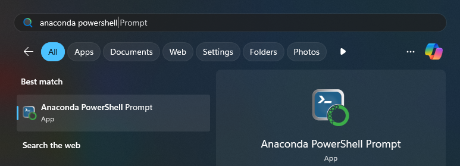

# 📦 Installation

```{admonition} Warning
:class: attention

Please read the [🔏 Data Privacy](dataprivacy.md) section before proceeding with this step, in order to understand whether CliMB is compatible with your data and use case.
```

```{admonition} Installation on company/organization systems
:class: seealso

It is common within organizations to have certain restrictions on installing software on their systems, or to impose some restricions on accessible URLs through VPNs or firewalls. If you are facing such restrictions when trying to install CliMB by following the steps below, please ask your IT department for assistance.
```

In order to use CliMB, you need to accomplish the following three steps:
1. [🐍 Set up the `conda` environments](#set-up-the-conda-environments)
2. [🔑 Obtain the API keys for the third-party LLM](#obtain-the-api-keys-for-the-third-party-llm)
3. [📈 Install the CliMB package](#install-the-climb-package)


(set-up-the-conda-environments)=
## 1. 🐍 Set up the `conda` environments

CliMB uses [`conda`](https://docs.conda.io/projects/conda/en/latest/user-guide/getting-started.html) to manage the Python environments. Before installing CliMB, you need to set up two `conda` environments as follows.
1. If you do not have `conda` ("Anaconda") installed on your system, you should install the [`miniconda`](https://docs.anaconda.com/free/miniconda/) distribution by following the appropriate instructions below.
    ```{tab} Windows
    * Follow the [Installing on Windows](https://docs.conda.io/projects/conda/en/latest/user-guide/install/windows.html) guide.
    * We recommed you use the ["Miniconda" installer](https://docs.anaconda.com/miniconda/).
    * "Verify your installer hashes" step is optional.
    ```
    ```{tab} macOS
    * Follow the [Installing on macOS](https://docs.conda.io/projects/conda/en/latest/user-guide/install/macos.html) guide.
    * We recommed you use the ["Miniconda" installer](https://docs.anaconda.com/miniconda/).
    * "Verify your installer hashes" step is optional.
    ```
    ```{tab} Linux
    * Follow the [Installing on Linux](https://docs.conda.io/projects/conda/en/latest/user-guide/install/linux.html) guide.
    * We recommed you use the ["Miniconda" installer](https://docs.anaconda.com/miniconda/).
    * "Verify your installer hashes" step is optional.
    ```
2. Create the *main* conda environment for CliMB:
    :::{admonition} Running commands
    :class: tip

    If you are not familiar with running commands in a terminal (a.k.a. command prompt, command line interface etc.), please see this tip box for a quick overview of the appropriate terminal to use on your operating system. The commands shown in CliMB documentation should work with the terminals described here.

    **Note:** these are terminal commands, and **not** Python shell (REPL) commands.

    You do not need to type in the comment lines, e.g. `# Create the environment:`, these are for your information only.

    ```{tab} Windows
    * On Windows, you should use **Anaconda PowerShell Prompt**.
    * You can find this by searching for "Anaconda PowerShell Prompt" in the Start menu.
        {width="75%"}
    ```

    ```{tab} macOS
    * To launch a command line terminal, you can follow this [**Execute commands and run tools in Terminal on Mac**](https://support.apple.com/en-gb/guide/terminal/apdb66b5242-0d18-49fc-9c47-a2498b7c91d5/mac).
    * For more details, see the [**Terminal User Guide**](https://support.apple.com/guide/terminal).
    ```

    ```{tab} Linux
    * The specifics of launching the terminal differs between different versions of Linux.
    * E.g. on Ubuntu, follow [this guide](https://ubuntu.com/tutorials/command-line-for-beginners#3-opening-a-terminal).
    * For other distributions, please find the appropriate giude online.
    ```

    :::

    ```bash
    # Create the environment:
    conda create -n climb python=3.9 -y
    
    # Install a dependency needed for PDF generation:
    conda install conda-forge::weasyprint
    ```
    Python `3.9` or newer should be set.

    ```{admonition} Known installation issue on Windows systems
    :class: note

    There is a known installation issue on Windows systems related to the WeasyPrint package, which can cause the PDF
    report generation functionality to not work. This can be resolved by following
    [this troubleshooting step](troubleshooting.md#windows-pangoft2).
    ```

3. Create a *separate* `conda` environment that will be used for *code execution*:

    ```{admonition} Caution
    :class: caution

    The exact environment name `climb-code` must be used.
    ```

    ```bash
    # Create and activate the environment, Python `3.9` or newer should be set:
    conda create -n climb-code python=3.9 -y

    # Activate the environment:
    conda activate climb-code
    # Install some standard packages in the environment. If more packages are needed by generated code, those will be automatically installed by the tool.
    conda install pandas numpy matplotlib seaborn scikit-learn shap -y
    # Exit this environment:
    conda deactivate
    ```

    CliMB will automatically use this environment when executing the generated code.


(obtain-the-api-keys-for-the-third-party-llm)=
## 2. 🔑 Obtain the API keys for the third-party LLM

```{admonition} Warning
:class: attention

Please read the [🔏 Data Privacy](dataprivacy.md) section before proceeding with this step, in order to make an informed decision about which LLM provider is suitable for your use case.
```

CliMB currently supports the following third-party LLM providers:
* [OpenAI](https://platform.openai.com/)
* [Azure OpenAI Service](https://learn.microsoft.com/en-us/azure/ai-services/openai/overview)

More LLM providers and open source models will be supported in the future.

```{admonition} Tip
:class: tip

Please select between the tabs ("OpenAI", "Azure OpenAI Service" etc.) below to see the instructions for the LLM provider you have chosen.
```

```{tab} OpenAI
1. Sign up for OpenAI platform [here](https://platform.openai.com/signup).
2. Fund your account by following [this guide](https://help.openai.com/en/articles/8264644-what-is-prepaid-billing).
3. Follow [this guide](https://help.openai.com/en/articles/4936850-where-do-i-find-my-openai-api-key) to get your API key.
    * ⚠️ Never share your API key with anyone and treat it as a "password". A reminder to developers to to never commit your API keys to a public repository!
    * Make note of this **key** as it is needed later.
```

```{tab} Azure OpenAI Service
1. Create an Azure account [here](https://azure.microsoft.com/en-gb/pricing/purchase-options/azure-account?icid=azurefreeaccount).
2. Create an Azure OpenAI Service resource by following [this guide](https://learn.microsoft.com/en-us/azure/ai-services/openai/how-to/create-resource).
    * At the final **"Deploy a model"** step, we recommend selecting `gpt-4` or `gpt-4o`. More specifically, please select one of these [versions](https://github.com/vanderschaarlab/climb/blob/main/src/climb/engine/const.py#L1-L8).
    * When you are deploying the model, make note of the **① deployment name** that you use as it is needed later.
3. In [Azure OpenAI Studio](https://oai.azure.com/), click the resource name at the top right of the screen to find: **② endpoint** and **③ key**, make note of these as they are needed later.
    
    
```


(install-the-climb-package)=
## 3. 📈 Install the CliMB package

1. Clone the CliMB repository and navigate to the directory (we will call this the **repo directory**)
    ```bash
    # Clone the repository:
    git clone https://github.com/vanderschaarlab/climb.git

    # Navigate inside the repo directory:
    cd climb
    ```
2. Activate the *main* `conda` environment and install the package itself (this will install all the dependencies as well):
    ```bash
    # Activate the main environment:
    conda activate climb

    # Install the CliMB package:
    pip install -e .
    ```
3. Finally, you need to set up the configuration file for the LLM provider you chose.
    * Copy the [Example `.env`](https://github.com/vanderschaarlab/climb/tree/main/config_examples/.env) file to the **repo directory**.
    Note that it should be placed directly inside the `climb` folder, **not** inside any subfolder; please see the end of this subsection below
    to check what your repo directory should contain at the end of the configuration process. On Windows you may wish to rename this file to `keys.env`
    to avoid the file being hidden / extension confusion.

    * Configure CliMB to work with the LLM provider you chose by following the instructions in the appropriate tab below.
    ```{tab} OpenAI
    * Open the `.env`/`keys.env` file in the **repo directory** and replace the value of
        ```ini
        OPENAI_API_KEY="API_KEY_FOR_OPENAI"
        ```
    with the **key** you obtained.
    ```

    ```{tab} Azure OpenAI Service
    1. Open the `.env`/`keys.env` file in the **repo directory**.
        ```ini
        AZURE_OPENAI_API_KEY__my-endpoint-1="API_KEY_FOR_AZURE_ENDPOINT_1"
        ```
        * Update the value `"API_KEY_FOR_AZURE_ENDPOINT_1"` with the **③ key** you obtained.
        * Replace `my-endpoint-1` template with the ID of the endpoint you are actually using. For example, if your endpoint is `https://my-clinic.openai.azure.com/`, use the `my-clinic` part. In this example case, the line would look like:
            ```ini
            AZURE_OPENAI_API_KEY__my-clinic="your actual ③ key"
            ```
    2. Copy the [Example `az_openai_config.yml`](https://github.com/vanderschaarlab/climb/tree/main/config_examples/az_openai_config.yml) file to the **repo directory**.
    3. Open the `az_openai_config.yml` file in the **repo directory**:
        ```yaml
        models:
            - name: "your-custom-name"
            # ^ This is to identify the model in the UI, it can be anything.
            endpoint: "https://my-endpoint-1.openai.azure.com/"
            # ^ The endpoint of azure openai service you are using.
            deployment_name: "your-deployment-name"
            # ^ The deployment name of the model you are using.
            api_version: "2024-02-01"
            # ^ The api version, see
            # - https://learn.microsoft.com/en-us/azure/ai-services/openai/reference#api-specs
            # - https://learn.microsoft.com/en-us/azure/ai-services/openai/api-version-deprecation
            model: "gpt-4-0125-preview"
            # ^ This needs to match the model type you set up in the Azure OpenAI Portal.
            # See the allowed options here:
            # - https://github.com/vanderschaarlab/climb/blob/main/src/climb/engine/const.py#L1-L8
        ```
        * You need to set the value of `endpoint` to **② endpoint** and `deployment_name` to **① deployment name**.
        * Make sure th `model` field matches the model type you deployed in the Azure OpenAI Portal.
        * Make sure the `api_version` field matches one of the [versions available](https://learn.microsoft.com/en-us/azure/ai-services/openai/reference#api-specs), it is best practice to use the latest version available.
        * The `name` field can be anything you want, it is used to identify the model in the UI.
    ```

    At the end of the configuration, your repo directory should looks something like this:
    ```bash
    climb/
    ├─ config_examples/
    ├─ docs/
    ├─ ...
    ├─ tests/
    .coveragerc
    .gitignore
    ...
    .env  # Or, keys.env. The main configuration file.
    az_openai_config.yml  # If using Azure OpenAI Service, its configuration file.
    ...
    setup.py
    tox.ini
    ```


(updating-climb)=
## 📦⬆️ Updating CliMB

To update to the latest version of CliMB, navigate to the **repo directory**, then follow these steps:

1. Pull the latest changes by running:
    ```bash
    git pull
    ```
1. Update the package:
    ```bash
    # Activate the environment:
    conda activate climb
    # Update the package:
    pip install -U -e .
    ```


(system-requirements)=
## 🖥️ System Requirements

CliMB is compatible with Windows, MacOS, and Linux operating systems.

CliMB and the tools it uses can work on a range of hardware configurations, but we recommend the following rough minimum
requirements for a smooth experience:
* a CPU with at least 4 cores,
* 16GB of RAM,
* NVIDIA GPU with at least 4GB of memory (not strictly necessary, but recommended for much faster performance).

Better hardware will provide a more performant experience, especially when working with large datasets or complex models.

Particularly large datasets will push the RAM and GPU RAM requirements higher, so please keep this in mind when working with your data.
