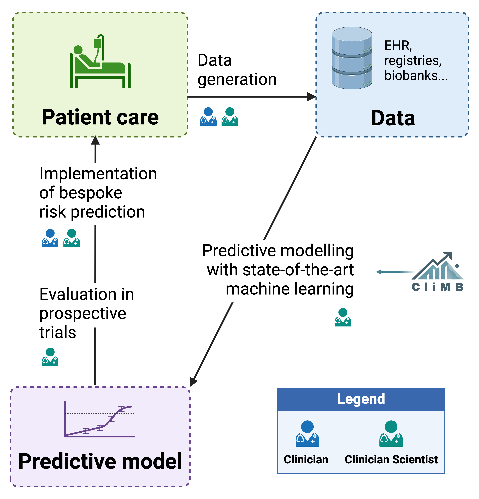
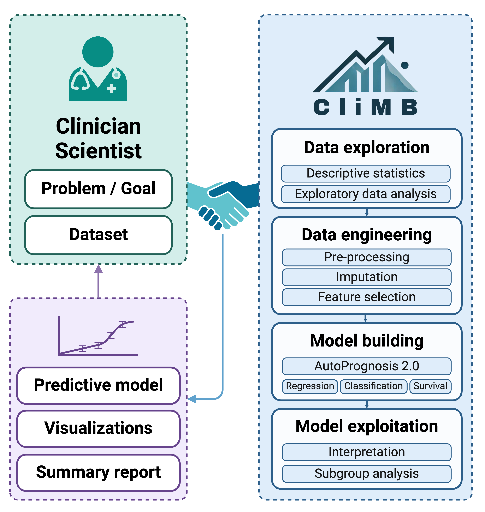

<!-- CliMB README.md -->


#  CliMB

> **CliMB**: **Cli**nical **M**achine learning **B**uilder

This repository is the implementation of the system as described in the preprint [CliMB: An AI-enabled Partner for Clinical Predictive Modeling](http://arxiv.org/abs/2410.03736).

[ Watch the demo](https://www.youtube.com/watch?v=76XuR0K3F5Y)

[](https://www.youtube.com/watch?v=76XuR0K3F5Y)


## 🏥 Overview
CliMB is an AI-enabled partner designed to empower clinician scientists to create predictive models from real-world clinical data, all within a single conversation. With its no-code, natural language interface, CliMB guides you through the entire data science pipeline, from data exploration and engineering to model building and interpretation. The intuitive interface combines an interactive chat with a dashboard that displays project progress, data transformations, and visualizations, making it easy to follow along. Leveraging state-of-the-art methods in AutoML, data-centric AI, and interpretability tools, CliMB offers a streamlined solution for developing robust, clinically relevant predictive models.

 &nbsp;&nbsp;&nbsp;&nbsp;&nbsp; 

Our vision is for CliMB to integrate seamlessly into the clinician's workflow, supporting the complete cycle of clinical predictive modeling, and ultimately democratizing machine learning and AI utilization in healthcare.


(data-privacy)=
## 🔏 Data Privacy

```{admonition} Warning
:class: attention

It is crucial to understand the data privacy and confidentiality implications of using CliMB. Please ensure to read this section prior to using the system.
```


When using CliMB with real-world clinical data, you as the clinician scientist act as the data steward, and are responsible for ensuring that the use of the data complies with all relevant laws and regulations, as well as ethical considerations. CliMB aims to provide a secure and privacy-preserving environment for data exploration and model building, while balancing this with leveraging the capabilities of the most advanced large language models (LLMs). This section summarizes the data privacy fundamentals of CliMB and should allow you to make an informed decision about using the system with your data.

### CliMB's Privacy-Preserving Features
1. **Local storage of data.** All dataset files (original or modified in any way by CliMB) are
stored locally on your machine. Hence, the data files are never uploaded to any third-party servers.
2. **Local code execution.** All code execution performed by CliMB, either through code generation or predefined tool invocation occurs locally on the your machine. Hence, no working directory files of any kind (including saved predictive models, image files, tool output artifacts
etc.) leave the machine that you are using CliMB on.

### Privacy Implications of Using Third-party LLMs
CliMB currently supports the following third-party LLMs providers:
* [OpenAI](https://platform.openai.com/),
* [Azure OpenAI Service](https://learn.microsoft.com/en-us/azure/ai-services/openai/overview).

This allows for making use of more powerful LLMs (GPT-4 and beyond). Integration with locally-deployable LLMs (e.g., the [Hugging Face](https://huggingface.co/) ecosystem) is under development, but not yet available.

In order to use third-party, proprietary LLMs, CliMB uses their API ([What's an API?](https://www.contentful.com/api/)). This means that:
* The **message data** is transferred, encrypted, via the internet to the LLM provider's (cloud) servers, which then generate a response message.
* The **message data** may be stored by the LLM provider for some limited time (e.g., often 30 days) in order to detect and prevent abuse of the API.


```{admonition} Note
:class: note

**Message data** in CliMB is all the content you see in the chat interface, including the text you type, the text the system generates, and the output of code execution and tool invocations. This is also know as "prompts" and "completions", or the "context". This data *may* contain sensitive information, such as variable names, categorical values, and other data that you are working with in your predictive modeling project. It is unlikely to contain any patient records in full, as this is not required in the CliMB workflow, however this is **not guaranteed**.
```


It is critical that you understand the terms of service of the LLM provider you choose to use with CliMB. Below are links to the overviews of how each provider uses your data (but a detailed review of the terms of service is highly recommended):
* **OpenAI**:
    * [OpenAI Platform - How we use your data](https://platform.openai.com/models/how-we-use-your-data)
    * [Privacy Policy](https://openai.com/policies/row-privacy-policy/)
* **Azure OpenAI Service**:
    * [Data, privacy, and security for Azure OpenAI Service](https://learn.microsoft.com/en-us/legal/cognitive-services/openai/data-privacy?tabs=azure-portal)
    * [Privacy in Azure](https://azure.microsoft.com/en-gb/explore/trusted-cloud/privacy)

For instance, in case of **Azure OpenAI Service**, the following applies:
> Your prompts (inputs) and completions (outputs), your embeddings, and your training data:
> * are NOT available to other customers.
> * are NOT available to OpenAI.
> * are NOT used to improve OpenAI models.
> * are NOT used to train, retrain, or improve Azure OpenAI Service foundation models.
> * are NOT used to improve any Microsoft or 3rd party products or services without your permission or instruction.
> Your fine-tuned Azure OpenAI models are available exclusively for your use.

However, the following points regarding data storage and human review for purposes of abuse prevention, and the process of obtaining an exemption should also be read and understood:
* [Data storage for Azure OpenAI Service features](https://learn.microsoft.com/en-us/legal/cognitive-services/openai/data-privacy?tabs=azure-portal#data-storage-for-azure-openai-service-features)
* [Preventing abuse and harmful content generation](https://learn.microsoft.com/en-us/legal/cognitive-services/openai/data-privacy?tabs=azure-portal#preventing-abuse-and-harmful-content-generation)
* [How can customers get an exemption from abuse monitoring and human review?](https://learn.microsoft.com/en-us/legal/cognitive-services/openai/data-privacy?tabs=azure-portal#how-can-customers-get-an-exemption-from-abuse-monitoring-and-human-review)


```{admonition} Warning
:class: attention

If using **OpenAI** as the LLM provider, the corresponding terms of service should be reviewed in detail.
```


A useful additional resource for understanding the privacy implications of specific LLM providers is PhysioNet's [Responsible use of MIMIC data with online services like GPT](https://physionet.org/news/post/gpt-responsible-use). PhysioNet is the provider of the MIMIC datasets, a set of widely-used open access datasets in clinical research.


```{admonition} Tip
:class: tip

Data [anonymization and pseudonymization](https://www.ucl.ac.uk/data-protection/guidance-staff-students-and-researchers/practical-data-protection-guidance-notices/anonymisation-and) are important techniques for maintaining compatibility with GDPR and similar regulations, and these are generally advised when using CliMB with clinical data.
```


## 📦 Installation

```{admonition} Warning
:class: attention

Please read the [🔏 Data Privacy](#data-privacy) section before proceeding with this step, in order to understand whether CliMB is compatible with your data and use case.
```

Please follow the steps in [📦 Installation](installation.md) section in the documentation to install CliMB.

To update to the latest version of CliMB, please follow [📦⬆️ Updating CliMB](installation.md#updating-climb)


## 🚀 Usage
To launch CliMB UI, from the **repo directory**, run:
```bash
streamlit run entry/st/app.py
```

This will show the output like:
```
  You can now view your Streamlit app in your browser.

  Local URL: http://localhost:8501
  Network URL: http://192.168.0.68:8501
```

If you encounter errors or problems when running CliMB for the first time, please check out the [🛠️ Troubleshooting](troubleshooting.md) section, as it has the resoulutions steps for some common intallation and set up problems. For any other problems, please submit a GitHub issue [here](https://github.com/vanderschaarlab/climb/issues), or ask us on [Slack](https://join.slack.com/t/vanderschaarlab/shared_invite/zt-1u2rmhw06-sHS5nQDMN3Ka2Zer6sAU6Q).


## ✍️ Citing

If you use CliMB in your work, please cite the associated paper:
```bibtex
@article{saveliev2024climb,
  title={CliMB: An AI-enabled Partner for Clinical Predictive Modeling},
  author={Saveliev, Evgeny and Schubert, Tim and Pouplin, Thomas and Kosmoliaptsis, Vasilis and van der Schaar, Mihaela},
  journal={arXiv preprint arXiv:2410.03736},
  year={2024}
}
```
