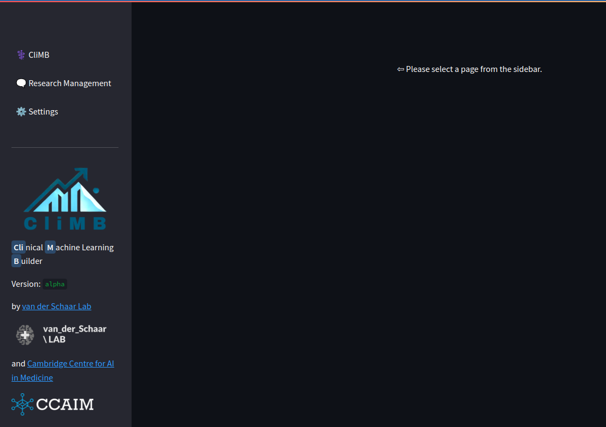

# 🚀 Quickstart Guide

```{admonition} Installation
:class: note

Please follow the [📦 Installation](installation.md) section before proceeding with the quickstart guide.

Some of the installation and configuration steps may require assistance from your IT department.
```

## Launch the CliMB UI

First, navigate to the the CliMB **repo directory** in the terminal.

```{admonition} Tips
:class: tip

* The location of the **repo directory** is explained in the [📈 Install the CliMB package](installation.md#install-the-climb-package) section of the documentation. Don't forget to run `cd climb` to change to the repo directory.

* For an intro on executing commands in the terminal, see the [🐍 Set up the `conda` environments](installation.md#set-up-the-conda-environments) section.
```

To launch CliMB UI, run the command:
```bash
streamlit run entry/st/app.py
```

This will show the output like:
```
  You can now view your Streamlit app in your browser.

  Local URL: http://localhost:8501
  Network URL: http://192.168.0.68:8501
```

## Start a new session

You will land to the CliMB UI as shown below:



Please select **🗨️ Research Management** from the side panel.


From the **Select engine** dropdown, choose the engine that matches your LLM provider.

You may give a custom name to your session in the **Session Name** field, otherwise an auto-generated name will be assigned.

The **Engine parameters** section allows you to configure certain settings of the "engine", such as the specific LLM model (when applicable).
Hover over the <i class="fa-regular fa-circle-question"></i> icon next to each setting to see a tooltip with more information.

Once you select **Start new session**, you will be taken to the main **⚕️ CliMB** session screen.

## Become familiar with a CliMB session workflow

At this point, it is recommended to familiarize yourself with the flow of a CliMB session.

We provide the below demo video to help you understand the workflow and the UI, including the components of the dashboard.

[ Watch the demo](https://www.youtube.com/watch?v=76XuR0K3F5Y)

[](https://www.youtube.com/watch?v=76XuR0K3F5Y)

For more detail about CliMB, please refer to the paper [CliMB: An AI-enabled Partner for Clinical Predictive Modeling](http://arxiv.org/abs/2410.03736).
